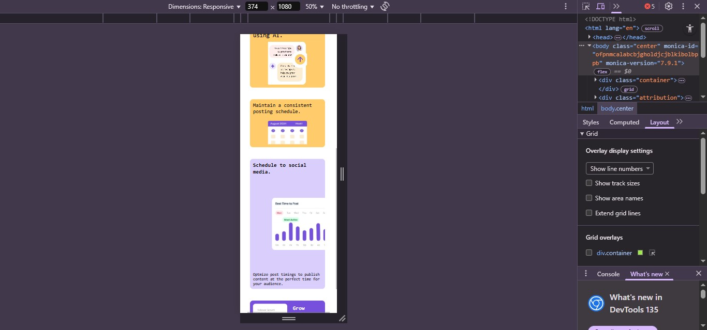

# Frontend Mentor - Bento grid solution

This is a solution to the [Bento grid challenge on Frontend Mentor](https://www.frontendmentor.io/challenges/bento-grid-RMydElrlOj). Frontend Mentor challenges help you improve your coding skills by building realistic projects. 

**Note: Delete this note and update the table of contents based on what sections you keep.**

## Overview

### The challenge

Users should be able to:

- View the optimal layout for the interface depending on their device's screen size

### Screenshot

### Links

- Solution URL: [GitHub Link](https://github.com/Othniel-Nduka/FM-Bento_Grid)
- Live Site URL: [Live Vercel Site](https://fm-bento-grid-lyart.vercel.app/)

## My process

### Built with

- Semantic HTML5 markup
- CSS custom properties
- Flexbox
- CSS Grid
- Desktop-first workflow

### What I learned

I learned that I'm better off using css grid-template-areas than the grid-row and grid-column properties. It is way more easire for me, although it'll still take some time to get used to it. But I'm better off with that.

### Continued development

I would say that I would continue to use grids in the future alongside flexbox, I'm fascinated by grids though I don't use it often and I wonder, with some things I have seen on react I would like to think that they are similar in structure.

### Useful resources

- [Become A Master Grid CSS in 13 Minutes](https://www.example.com) - This really helped me in better understanding the concepts of grid-templates and how they work.
## Author

- Frontend Mentor - [@Othniel-Nduka](https://www.frontendmentor.io/profile/Othniel-Nduka)

